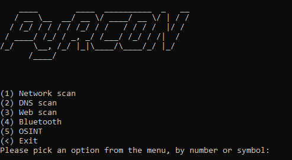

# PyRCON  
A menu based recon tool made in Python  



## __Features__  

### Network Recon
* TCP Scans
* UDP Scans
* ICMP Scans
* Other scans (IKE Scan)

### DNS Recon
* Reverse DNS
* Get host by name
* DNS Query

### Web scans
* Directory check
* Status check
* Web crawl
* Sub domain

### Bluetooth
* Get nearby
* Service scan

### OSINT
* Instagram search
* Facebook search
* Twitter search
* Website screenshot
* Exif

## Requirements

### Pip requirements
Note: you may need to install these as root (to use them while running PyRCON)
```bash
pip install DecimScanner
pip install imgkit
git clone https://github.com/smarnach/pyexiftool
cd pyexiftool
python3 setup.py install
```

### Apt requirements
```bash
sudo apt-get install exiftool
sudo apt-get install wkhtmltopdf
```

### Google CSE

You will need to create a few google CSE search engines and place them in the /config/googlecse.json file
```
Guide (google developer console
1) Head to https://console.cloud.google.com/
2) Create a new project and name it
3) Head to the credidentials section and copy your API key
4) Place your API key in the /config/googlecse.json file
```

```
Guide (CSE Set up):
1) Head to https://cse.google.com/ and register an account (if necessary)
2) Select "New search engine" and add "https://www.instagram.com/"
3) Copy the CSE ID and place it into the /config/googlecse.json file
4) Repeat with "https://twitter.com/" and "https://en-gb.facebook.com/public/*"
```

